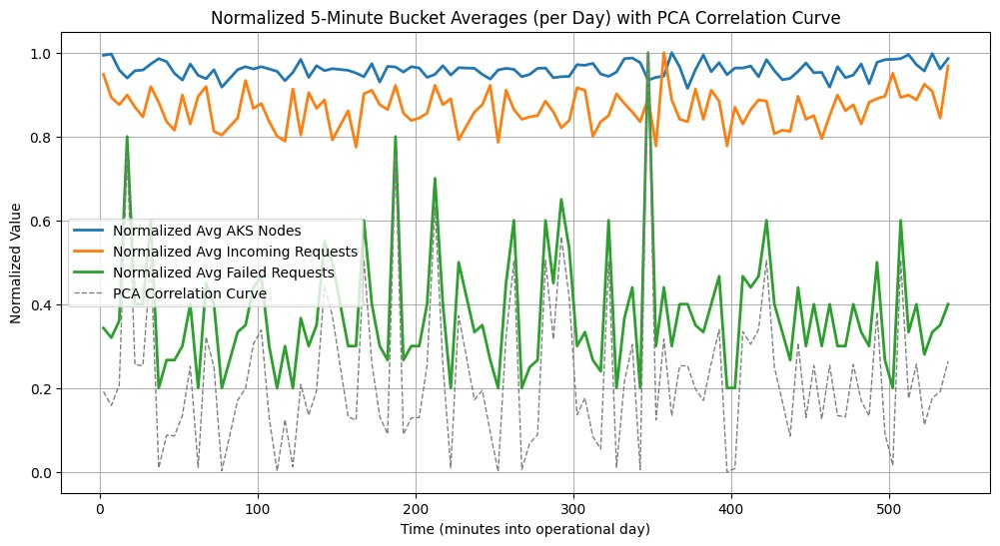

(Или как мы научились не волноваться и полюбили облако)

Вы когда-нибудь задумывались, как облачный сервис с множеством ИИ-агентов справляется с потоком входящих запросов пользователей, не взрываясь? Что ж, больше не нужно гадать! В этом блоге мы отправимся в увлекательное путешествие по симуляции, которая проверяет, насколько грациозно система агентного ИИ (набор ИИ-агентов, работающих вместе) масштабируется, разделяется и обрабатывает различные запросы. Мы расскажем о нашей структуре, предположениях, коде и результатах — с красивой диаграммой, чтобы показать наши данные.

<!--more-->

## Задача

Представьте, что вы управляете волшебной системой агентного ИИ в облаке. Пользователи отправляют запросы, каждый из которых состоит из некоторого количество токенов, и ваши ИИ-агенты должны понять, как их обработать. Иногда агент может самоcтоятельно обрработать запрос. В других случаях он может решить, что запрос надо разбить на кучу подзапросов, и запустить еще толпу агентов на их обработку, а затем собрать все ответы в готовый результат. При построении системы мы хотим заранее оценить:

- Сколько запросов мы получаем всего?
- Сколько мы разделяем по сравнению с отправкой напрямую?
- Как часто мы отбрасываем запросы, если они превышают емкость нашего вычистельного кластера?
- Как все это влияет на использование ресурсов и общую стоимость (в долларах)?

Другими словами, мы хотим смоделировать повседневную жизнь нашей системы агентного ИИ и посмотреть, что происходит когда все хорошо. Ну или аоборот, увидеть, насколько все бывает плохо.


## Наша структура симуляции

Для симуляции мы используем Python в google colab. Движок для синуляци - `SimPy`. Это библиотека симулации дискретныз событий, подходящая для симуляции сисем массового обслуживания. Наши основные шаги выглядели примерно так:

1. Генерация входящих запросов: Мы создаем пакет пользовательских запросов с случайными размерами (в токенах).
2. Маршрутизация запросов: Некоторые запросы идут напрямую к ИИ-агентам; другие разделяются на несколько меньших запросов, если требуют некоторой индивидуальной обработки.
3. Моделирование стоимости: Мы отслеживаем, нагрузку, которую генерируют запросы, количество токенов которое приходит в нашу систему, количество токенов, которое наша система генерирует для передачи в LLM.
4. Статистика: Мы записываем все — количество прямых запросов, разделенных запросов, отброшенных запросов, общее количество токенов и стоимость.
5. Повтор: Мы запускаем всю эту симуляцию несколько раз (100 запусков в нашем случае), чтобы получить хорошие сводные статистические данные.

Эта структура дает нам надежный способ увидеть, как наша гипотетическая облачная система ИИ ведет себя в различных случайных условиях.


## Предположения и числа

Теперь самое интересное — как мы решили, какие числа использовать?

- Распределение токенов: Мы предположили, что пользовательские запросы имеют различные размеры, с определенной средней длиной и стандартным отклонением. Система (т.е. наша группа ИИ-агентов) может добавлять некоторые дополнительные токены для каждого запроса, потому что, ну, а вдруг.
- Порог разделения: Мы предположили, что часть запросов будут слишком сложными, и такие запросы разделяются на несколько подзапросов и выполняются последовательной цепочной анентов.
- Стоимость в долларах: Мы использовали вымышленную модель стоимости для использования LLM и AKS. Например, возможно, 1 миллион токенов стоит определенное количество долларов, и каждый узел AKS имеет стоимость за час. Мы стремились сохранить эти затраты в правдоподобных пределах для демонстрационных целей.
- Отбрасывание запросов: Мы позволили системе отбрасывать запросы, если они были слишком большими или если кластер был на пределе. Мы предположили, что это более экономично, чем масштабироваться до бесконечности — жестко, но это всего лишь симуляция!

Наша цель заключалась не в создании идеально реалистичной производственной среды, а в том, чтобы подчеркнуть компромиссы и поведение, которые могут возникнуть при этих предположениях.

## Быстрый взгляд на код

Мы не будем перегружать вас всеми деталями, но вот общая структура нашего кода на Python:

```python
import numpy as np
import pandas as pd
from tqdm import trange

NUM_RUNS = 100
results = []

for run in trange(NUM_RUNS):
    # 1. Генерация запросов
    user_queries = np.random.poisson(lam=5000, size=some_size)  # Просто пример

    # 2. Маршрутизация запросов
    direct_requests = 0
    split_requests = 0
    dropped_requests = 0
    total_tokens = 0
    
    # ... Некоторая логика для разделения или отбрасывания запросов ...
    
    # 3. Отслеживание стоимости (в долларах)
    llm_cost = ...
    aks_cost = ...
    total_cost = llm_cost + aks_cost

    # 4. Добавление результатов для каждого запуска
    results.append({
        'direct_requests': direct_requests,
        'split_requests': split_requests,
        'dropped_requests': dropped_requests,
        'total_requests': direct_requests + split_requests,
        'llm_cost': llm_cost,
        'aks_cost': aks_cost,
        'total_cost': total_cost,
        # ... другие статистические данные ...
    })

# Преобразование результатов в DataFrame и вычисление сводной статистики
df = pd.DataFrame(results)
summary = df.describe()
print(summary)
```

По сути:

1. Мы генерируем пакет запросов с случайными размерами.
2. Мы решаем, направлять их напрямую, разделять или отбрасывать.
3. Мы рассчитываем, сколько токенов прошло и стоимость в долларах.
4. Мы собираем все эти статистические данные в DataFrame и выводим сводную статистику.

Ноутбук [здесь](https://github.com/eosfor/scripting-notes/blob/8d0af479302fd43f40b73627d16f72d8a12c7d79/notebooks/en/agentic-ai-infra-simulation/sim.ipynb)

## Результаты: Великое раскрытие

После 100 запусков симуляции мы получили некоторые интересные сводные статистические данные:

| Метрика               | среднее    | std     | мин       | макс       |
|-----------------------|------------|---------|-----------|------------|
| прямые запросы        | 6479       | 85.76   | 6279      | 6641       |
| разделенные запросы   | 25931      | 157     | 25462     | 26347      |
| отброшенные запросы   | 591        | 38.74   | 506       | 696        |
| всего запросов        | 32410      | 182     | 31945     | 32823      |
| процент разделения    | 80.01      | 0.23    | 79.46     | 80.60      |
| токены пользовательских запросов | 3561909 | 53503   | 3445529   | 3669273   |
| токены системных запросов | 95085770 | 517611 | 93430542  | 96296984  |
| токены ответов LLM    | 42782889   | 225980  | 42077728  | 43267966  |
| всего токенов LLM     | 141430570  | 743063  | 139073264 | 143077558 |
| стоимость LLM (USD)   | 424        | 2.23    | 417       | 429        |
| стоимость AKS (USD)   | 858        | 2.32    | 852       | 864        |
| общая стоимость (USD) | 1283       | 4.35    | 1269      | 1293       |
| макс. узлы            | 11.00      | 0.00    | 11.00     | 11.00      |
| средн. узлы           | 8.01       | 0.02    | 7.95      | 8.07       |

Что все это значит?

- Мы отбрасываем относительно небольшое количество запросов (в среднем 591), что означает что наш кластер, в среднем, саравляется. Но иногда перегружен.
- Общая стоимость в долларах составляет около $1283, при этом стоимость LLM составляет около $424, а стоимость AKS — около $858. Похоже, что использование ИИ дешевле, чем наша вычислительная инфраструктура в этом сценарии!
- Максимальное количество узлов — 11, что указывает на то, что мы ограничили наш кластер 11 узлами. В среднем мы использовали около 8 узлов, что означает, что у нас есть небольшой запас перед тем, как мы начнем отбрасывать слишком много запросов.

И вот визуальная сторона дела (см. приложенную диаграмму). Она показывает:
- Нормализованные средние узлы AKS: Использование ресурсов с течением времени.
- Нормализованные средние входящие запросы: Нагрузка, с которой сталкивается система.
- Нормализованные средние неудачные запросы: Время, когда запросы могут быть отброшены.
- Кривая корреляции PCA: Изящный способ увидеть, какие метрики движутся вместе с течением времени. Если эта кривая подскакивает, это означает, что определенные переменные (например, входящие запросы и использование узлов) сильно коррелируют.

Из диаграммы видно, что всякий раз, когда нагрузка возрастает (зеленая линия), использование узлов AKS (синяя линия) обычно реагирует. Неудачные запросы (оранжевая линия) остаются относительно низкими, что указывает на то, что наша стратегия масштабирования хорошо справляется с большинством всплесков. Кривая корреляции PCA (серая пунктирная линия) помогает подтвердить, какие периоды показывают самые сильные взаимосвязи между этими метриками.



Подведение итогов (и вопрос к вам!)

Вот и все, друзья! Наша небольшая симуляция показывает, как облачная система агентного ИИ может вести себя при различных нагрузках, размерах токенов и ограничениях по стоимости. Мы сделали некоторые предположения о том, как запросы разделяются, что отбрасывается и как масштабируются затраты — но в реальности вы бы настроили эти параметры в соответствии с вашей производственной средой.

Вопрос к вам: Если вы управляете аналогичной системой ИИ-агентов, коррелируют ли ваши числа с нашими? Возможно, вы видите другое соотношение разделенных и прямых запросов, или, возможно, ваши затраты ведут себя иначе. Дайте нам знать, как наша модель сравнивается с вашими реальными опытами!

Мы надеемся, что это дало вам увлекательный взгляд на мир симуляции ИИ и планирования ресурсов. Если вам когда-нибудь будет интересно, не разорит ли ваша следующая большая идея банк (или ваш кластер), быстрая симуляция, подобная этой, может дать вам некоторое спокойствие — или, по крайней мере, направление для более детализированного моделирования!

Спасибо, что присоединились к нам в этом облачном серфинге, токеновом хрусте и управлении агентами. До следующего раза, удачных симуляций!