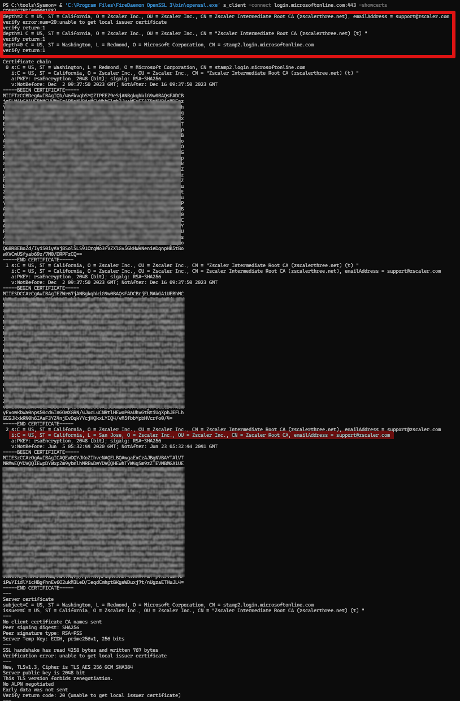
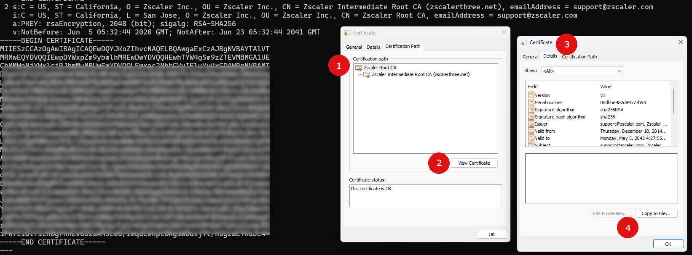

There are times when ZScaler can get quite bothersome, and recently, I had one of those moments. This note aims to share the steps needed to get the Azure CLI to cooperate with ZScaler.
<!--more-->

I came across a hiccup with Azure CLI, which presented me with the following error:


This tells me that Azure CLI is struggling to verify the certificate for `login.microsoftonline.com`. My suspicion was on ZScaler, acting as a middle-man, swapping out certificates to inspect HTTPS traffic. The focus here, however, is on the resolution steps.

The error message directs to [a Microsoft guide](https://learn.microsoft.com/en-us/cli/azure/use-cli-effectively?tabs=bash%2Cbash2#work-behind-a-proxy), which is somewhat helpful. It talks about a PEM-file that Azure CLI references for trusted certificates. We can duplicate the file, adding the extra certificates, and then setting the `REQUESTS_CA_BUNDLE` environment variable to point at our new file, so Azure CLI will be able to find and use it. What we need is to include the intermediate certificate chains from ZScaler in our list.

So, where do we find these certificates? This part is easier than it seems. You'll need `openssl` on hand. For Windows users, `winget` can be used to install it like this:

```powershell
winget install FireDaemon.OpenSSL
```

Next, we just need to prompt openssl to fetch the certificates from the endpoint:

```powershell
& 'C:\Program Files\FireDaemon OpenSSL 3\bin\openssl.exe' s_client -connect login.microsoftonline.com:443 -showcerts
```

You'll see something like this as the output:



What displays is a series of certificates. Starting with one for `x.microsoftonline.com`, followed by a couple of 'intermediate roots' from ZScaler, ending with the ZScaler root certificate at the end. These all must be placed into the PEM file we copied earlier. I simply added all three certificates into this file. Make sure to include everything from `BEGIN CERTIFICATE` to `END CERTIFICATE`, markers included.

The final touch concerns the `root certificate`, pointed out at the bottom of the output. This one signs off on the whole chain, so you need to isolate this last certificate, save it with a `.cer` extension, and open it up. This action opens up a window displaying the certification path, with the root certificate at the top. You should export it to a BASE64 encoded file and paste this into the PEM file too. With that, you've got the whole chain in place.
`


With these adjustments, Azure CLI should begin functioning without any certificate verification issues.