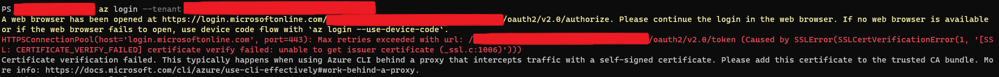
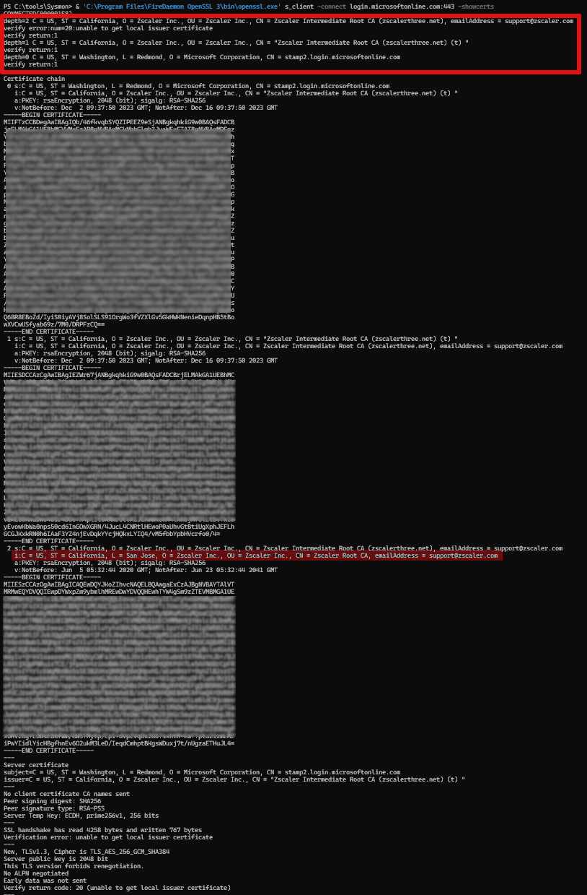
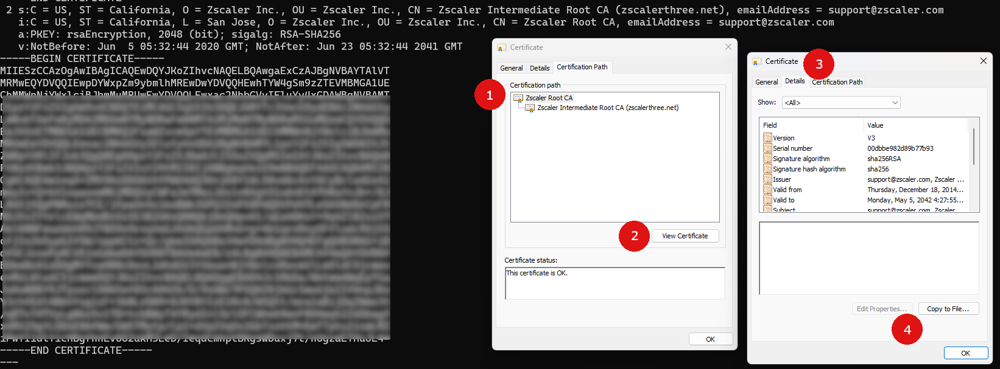

Иногда ZScaler может усложнить работу, и вот один из таких случаев. В этой заметке я хочу поделиться настройкой Azure CLI для работы с ZScaler.
<!--more-->

Не так давно мне пришлось столкнуться с проблемой в Azure CLI, которая выдала следующее сообщение об ошибке:



Это сообщение указывало на проблемы Azure CLI с проверкой сертификата для `login.microsoftonline.com`. Подозревалось, что проблема связана с ZScaler, который выступает в роли посредника, заменяя сертификаты для мониторинга HTTPS-трафика.

Сообщение об ошибке приводит к [руководству от Microsoft](https://learn.microsoft.com/en-us/cli/azure/use-cli-effectively?tabs=bash%2Cbash2#work-behind-a-proxy), которое дает общее представление о проблеме. Оно говорит о PEM-файле, содержащем доверенные сертификаты, который использует Azure CLI. Мы можем создать копию этого файла, добавить в него необходимые сертификаты и указать переменную окружения `REQUESTS_CA_BUNDLE`, чтобы Azure CLI обращался к обновленному списку. Нам нужно добавить в список сертификаты промежуточных цепочек от ZScaler.

Откуда же взять эти сертификаты? Это несложно. Вам понадобится `openssl`. В Windows его можно установить через `winget` следующим образом:

```powershell
winget install FireDaemon.OpenSSL
```

Затем нужно использовать openssl для получения сертификатов:

```powershell
& 'C:\Program Files\FireDaemon OpenSSL 3\bin\openssl.exe' s_client -connect login.microsoftonline.com:443 -showcerts
```

И вы увидите примерно следующее:



На экране появится ряд сертификатов. В начале списка сертификат для `x.microsoftonline.com`, за ним идут два промежуточных сертификата от ZScaler и, наконец, корневой сертификат ZScaler. Все они должны быть внесены в ранее скопированный PEM-файл. Я просто добавил эти три сертификата в файл. Важно включить весь текст от `BEGIN CERTIFICATE` до `END CERTIFICATE`, вместе с этими пометками.

Последний этап — работа с `корневым сертификатом`, на который указывают внизу вывода. Поскольку он подписывает всю цепочку, достаточно взять последний сертификат, сохранить его в отдельном файле с расширением `.cer` и открыть его. Так вы увидите окно с цепочкой сертификации и корневым сертификатом в верхней части. Его нужно экспортировать в файл в формате BASE64 и добавить в PEM-файл. Теперь у вас есть полная цепочка.



После этих действий Azure CLI должен начать работать корректно, без ошибок верификации сертификатов.