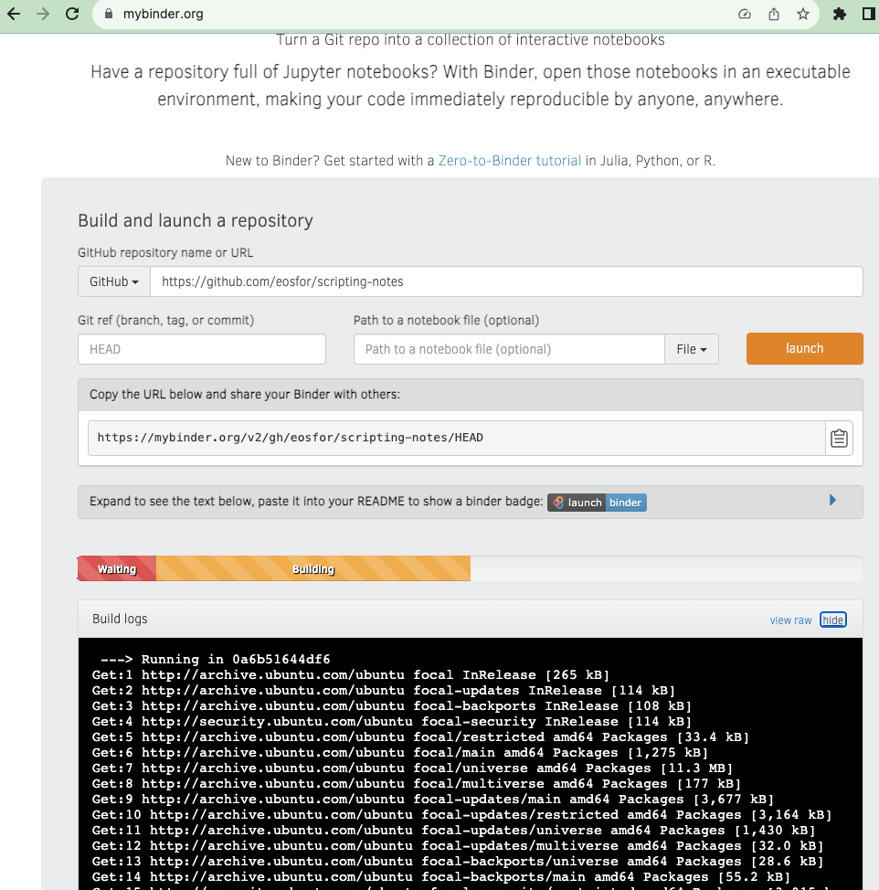

Let's dive a little deeper into the Jupyter-PowerShell duo. First, we’ll try to uncover the ‘why’ behind this alliance. Next, we’ll pry into the ‘how’ of the operation. And finally, we'll unveil the secrets of crafting a notebook and launching it into the digital cosmos for your team or, who knows, the whole world to see. Ready? Set. Go!

<!--more-->
## A Step Back

Let’s rewind and play the basics.

Jupyter Notebook, the digital realm where code and text coexist, allows you to craft and share documents bustling with live code, equations, visualizations, and narrative text. These digital playgrounds are a haven for data analysis, statistical modeling, machine learning, and so much more.

Now, every notebook has a heart, its file format - ipynb. It’s named after its ancestor, IPython Notebook, with IPython being a spellcaster's tool (interactive Python interpreter) that brought Jupyter to life. These `.ipynb` files not only keep your code alive but also hold onto the results and comments, making them a treasure trove for the curious minds.

Azure DevOps and Github play the open-book, letting you peek into these interactive notebooks in a read-only mode right in your browser. Imagine having an interactive book or report that’s not just easy to share but also stays fresh out of the oven with live code.

Why bother with all this, you wonder? Here's the scoop:

- **Automation**: Jupyter Notebooks can morph into automated guides, ready to hold your hand when things go south. They’re your go-to for recurring or sweat-breaking tasks, encapsulating the step-by-step wizardry that springs to action when things look grim.
- **Collaboration**: They are like digital campfires around which teams can gather, share code spells, exchange notes, and pass around the resource marshmallows. A stellar way to keep everyone on the same enchanted page.
- **Knowledge Transfer**: From the code-wizards (developers) to the digital architects (DevOps) and guardian angels (SRE teams), these notebooks are ancient scrolls that ease the passing down of sacred knowledge, ensuring a smooth sail from creation to maintenance of digital realms.

And, isn't it more fun to not just read the spell but also cast it right there and then, witnessing the magic unfold?

Jupyter Notebooks are not just tools; they are bridges of harmony between development, DevOps, and SRE, sparking seamless conversations and knowledge-barters among your squad. All in a fun, interactive, and friendly realm that adds a sprinkle of joy to everyone involved. Now, let’s descend further into this magical land and see how it all ticks!

## How it Works

It’s simpler than a spell. We wield the power of [.NET Interactive](https://github.com/dotnet/interactive) and its alliance with Jupyter, notably the Jupyter kernel it bestows. This kernel has a soft spot for our beloved PowerShell, along with C#, F#, and a few other mystical languages. Within the notebook, you can conjure cells with text in markdown format, and cells with code in one of the languages the kernel favors. Code cells, as you might guess, can be invoked right within the notebook, unveiling the results. These results find a cozy corner in the notebook as part of the `ipynb` file, ready to be shared along with the code spells and the lore surrounding them.

## How to Use It

Last time, we chatted about syncing up VSCode with Jupyter. This time, let’s unravel how to craft such a notebook that's eager to leap beyond the VSCode boundaries.

For this endeavor, we summon [Binder](https://mybinder.org) and Docker. This project helps transform your repository of notebooks into a Docker container and lets it riff online. You can even prep your own Docker file, with your choice of kernels, scripts, and tools. If you place it at the repository’s root, Binder will craft an image based on this file and set it on stage. A script of this sacred ritual can be found [here](https://github.com/eosfor/scripting-notes/blob/main/Dockerfile). The [Binder scripture](https://mybinder.readthedocs.io/en/latest/tutorials/dockerfile.html) mentions that Docker should be invoked only in mundane circumstances. My case is far from mundane; I beckon a kernel that's not a usual guest, and had to call upon some extra magical tools, like `minizinc`. This Dockerfile scripts a Docker image, forging an environment based on Jupyter Notebook with additional spell components and configurations. Here's a brief saga of each step in this Dockerfile:

1. **Multi-stage Build**:
   - A multi-stage Docker build is conjured with two base images: `minizinc/minizinc` and `jupyter/base-notebook:ubuntu-20.04`.
   - The `COPY --from=composer` spells transfer the essence from the first build stage (`composer`) to the second dominion (`builder`).
2. **Installing .NET CLI Dependencies**:
   - Arguments and ambient runes are set for the forthcoming spells.
   - The necessary relics, including `curl`, and other libraries vital for the .NET Core SDK to breathe are summoned.
3. **Installing .NET Core SDK**:
   - The `dotnet-install.sh` incantation is recited to call forth the .NET Core SDK.
   - A symbolic link to the `dotnet` realm is created.
4. **Adding NuGet Package Sources**:
   - A `NuGet.config` parchment is crafted with the NuGet package sources scripted onto it.
5. **Installing `nteract_on_jupyter`**:
   - `nteract_on_jupyter` is beckoned into existence via pip.
6. **Installing Microsoft.DotNet.Interactive**:
   - The `Microsoft.DotNet.Interactive` tool is conjured via the .NET CLI.
   - Following which, kernel specs for Jupyter are scripted via `dotnet interactive jupyter install`.
7. **Updating Permissions**:
   - Permissions on relics and dominions are updated to ensure they belong to the sage `jovyan`.
8. **Setting Working Domain and Copying Notebooks**:
   - The working domain is set to `${HOME}/notebooks/`.
   - Notebooks are invoked again into the working domain.

Once this file is crafted and rests at the root of the repository, [Binder](https://mybinder.org) can be directed to this repository. It will clone it and attempt to forge an image based on this file.

If the stars align, it will hoist it into a container registry and set it afloat. And voila, your code and your notebooks are now ready to greet the digital cosmos.

