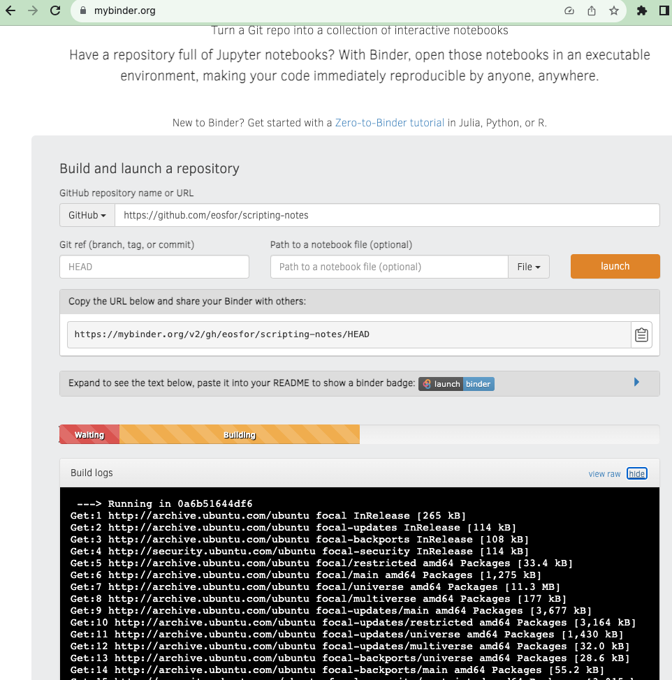
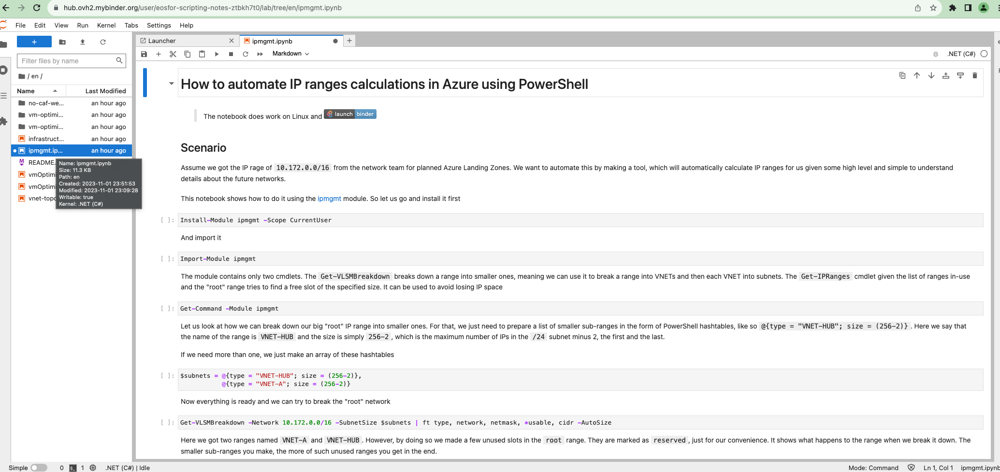

В этот раз мы поговорим обо всем этом более подробно. Для начала - зачем нам все это может понадобиться. Затем немного детальней о том, как это работает. И наконец - как сделать ноутбук и поделиться им со всем миром, ну или с другими командами на вашем проекте. Поехали

<!--more-->
## Полшага назад

Давайте немного повторим азы. 

Jupyter Notebook – это веб-приложение, которое позволяет создавать и делиться документами, содержащими живой код, уравнения, визуализации и объяснительный текст. Эти документы, ”записные книжки” или "ноутбуки", кому как нравится, можно использовать для анализа данных, статистического моделирования, машинного обучения и многого другого.

Ноутбуки работают со своим форматом файла - ipynb. Сокращение ipynb происходит от IPython Notebook, где IPython - это интерактивный интерпретатор Python, на котором изначально был основан Jupyter. Файлы `.ipynb` сохраняют и воспроизводят ваш код вместе с результатами и комментариями, что делает их отличным инструментом для обучения и совместной работы.

Azure Devops и Github дают  возможность открывать эти интерактивные ноутбуки в режиме read only прямо в браузере что делает процесс разработки и совместной работы еще более гладким и шелковистым. Это как иметь интерактивную книгу или интерактивный отчет, которым можно легко поделиться с командой и который всегда будет актуальным, благодаря живому коду внутри него.

Зачем все это нужно, спросите вы. Вот несколько сценариев

- **Автоматизация**: Jupyter Notebooks позволяет создать автоматизированные руководства, которые пригодятся при возникновении проблем. Это может быть особенно полезно для повторяющихся или трудоемких задач, где можно создать ноутбуки с документированными шагами, которые автоматически запускаются, когда что-то идет не так.
- **Совместная работа**: С помощью Jupyter Notebooks команды могут с легкостью делиться кодом, заметками и ресурсами. Это отличный способ поддерживать единый источник знаний и улучшать совместную работу между разработчиками и командами DevOps.
- **Передача знаний от разработчиков к DevOps и SRE командам**: С помощью Jupyter Notebooks можно создавать документацию и интерактивные руководства, которые помогают в передаче знаний от команды разработчиков к командам DevOps и SRE. Это упрощает процесс передачи знаний и помогает обеспечить гладкий переход от разработки к поддержке и управлению приложениями.

Согласитесь, что значительно веселее не просто прочитать кусок документации, а еще и прямо в ней запустить код и получить результат!

Jupyter Notebooks – это не просто инструмент, это мост между разработкой, DevOps и SRE, который помогает обеспечить бесшовное взаимодействие и обмен знаниями в вашей команде. И все это в интерактивном, легко доступном и дружелюбном формате, который облегчает жизнь каждому из участников процесса. А теперь, давайте углубимся в детали и узнаем, как все это работает на практике!

## Как это работает

Все относительно просто. Мы используем [.NET Interactive](https://github.com/dotnet/interactive) и его интеграцию с Jupyter, точнее Jupyter-ядро, которое они предоставляют. Ядро поддерживает всеми нами любимый PowerShell, а так же C#, F# и некоторые другие. В ноутбуке можно создавать ячейки с текстом, в формате маркдайун и ячейки с кодом, на одном из языков, поддерживаемых ядром. Ячейки с кодом, очевидно, можно исполнять прямо в ноутбуке, и получать результат. Результат сохраняется в ноутбуке, как часть `ipynb` файла, и таким образом можно делиться резьтатами работы вашего кода, вместе с документацией и самим кодом.

## Как этим пользоваться

В прошлом видео мы говорили о том, как настроить VSCode, для работы с Jupyter. В этот раз мы поговори о том, как можно сделать такой ноутбук, которым можно поделиться ноутбуком с теми у кого нет VSCode.

Для этого мы будем использовать [Binder](https://mybinder.org) и Docker. Пример такого файла можно найти [тут](https://github.com/eosfor/scripting-notes/blob/main/Dockerfile). В [документации к Binder](https://mybinder.readthedocs.io/en/latest/tutorials/dockerfile.html) указано, что Docker рекомендуется использовать только в обых случаях. У меня как раз такой случай, я использую ядро, которое не идет по-умолчанию, и мне нужно было установить некоторые дополнительные инструменты, как `minizinc`. Этот Dockerfile создает образ Docker для среды, основанной на Jupyter Notebook, с дополнительными установками и конфигурациями. Вот краткое разъяснение каждого этапа в этом Dockerfile:

1. **Многопроходная сборка**:
   - Используется многопроходная сборка Docker с двумя базовыми образами: `minizinc/minizinc` и `jupyter/base-notebook:ubuntu-20.04`.
   - Команды `COPY --from=composer` копируют файлы из первого этапа сборки (`composer`) во второй этап сборки (`builder`).
2. **Установка зависимостей для .NET CLI**:
   - Задаются аргументы и переменные среды для последующих команд.
   - Устанавливаются необходимые зависимости, включая `curl`, и другие библиотеки, необходимые для работы .NET Core SDK.
3. **Установка .NET Core SDK**:
   - Используется скрипт `dotnet-install.sh` для установки .NET Core SDK.
   - Создается символическая ссылка на исполняемый файл `dotnet`.
4. **Добавление источников пакетов NuGet**:
   - Создается файл `NuGet.config` с настроенными источниками пакетов NuGet.
5. **Установка `nteract_on_jupyter`**:
   - Устанавливается `nteract_on_jupyter` через pip.
6. **Установка Microsoft.DotNet.Interactive**:
   - Устанавливается инструмент `Microsoft.DotNet.Interactive` через .NET CLI.
   - Затем устанавливаются спецификации ядра для Jupyter через `dotnet interactive jupyter install`.
7. **Обновление прав**:
   - Обновляются права на файлы и каталоги, чтобы убедиться, что они принадлежат пользователю `jovyan`.
8. **Установка рабочего каталога и копирование ноутбуков**:
   - Устанавливается рабочий каталог на `${HOME}/notebooks/`.
   - Снова копируются ноутбуки в рабочий каталог.

После того как этот файл создан и лежит в корне репозитория, [Binder](https://mybinder.org)-у можно указать на этот репозиторий. Он склонирует его и попытается собрать образ на основе этого файла. 

Если все удачно - он загрузит его в container registry и запустит. В итоге ваш код и ваши ноутбуки станут доступны публично.

