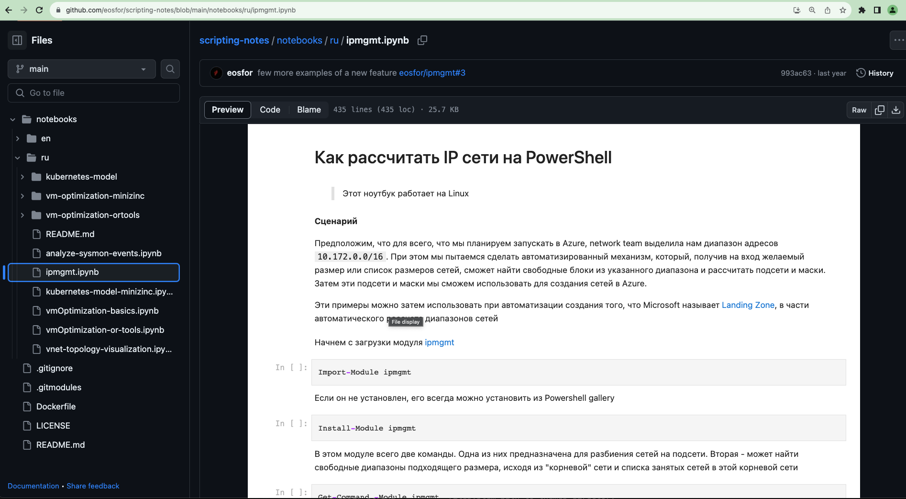

В этот раз мы поговорим обо всем этом более подробно. Для начала - зачем нам все это может понадобиться. Затем немного детальней о том, как это работает. И наконец - как сделать ноутбук и поделиться им со всем миром, ну или с другими командами на вашем проекте. Поехали

<!--more-->
## Полшага назад

Давайте немного повторим азы. 

Jupyter Notebook – это веб-приложение, которое позволяет создавать и делиться документами, содержащими живой код, уравнения, визуализации и объяснительный текст. Эти документы, ”записные книжки” или "ноутбуки", кому как нравится, можно использовать для анализа данных, статистического моделирования, машинного обучения и многого другого.

Ноутбуки работают со своим форматом файла - ipynb. Сокращение ipynb происходит от IPython Notebook, где IPython - это интерактивный интерпретатор Python, на котором изначально был основан Jupyter. Файлы `.ipynb` сохраняют и воспроизводят ваш код вместе с результатами и комментариями, что делает их отличным инструментом для обучения и совместной работы.

Azure Devops и Github дают  возможность открывать эти интерактивные ноутбуки в режиме read only прямо в браузере что делает процесс разработки и совместной работы еще более гладким и шелковистым. Это как иметь интерактивную книгу или интерактивный отчет, которым можно легко поделиться с командой и который всегда будет актуальным, благодаря живому коду внутри него.

Зачем все это нужно, спросите вы. Вот несколько сценариев

- **Автоматизация**: Jupyter Notebooks позволяет создать автоматизированные руководства, которые пригодятся при возникновении проблем. Это может быть особенно полезно для повторяющихся или трудоемких задач, где можно создать ноутбуки с документированными шагами, которые автоматически запускаются, когда что-то идет не так.
- **Совместная работа**: С помощью Jupyter Notebooks команды могут с легкостью делиться кодом, заметками и ресурсами. Это отличный способ поддерживать единый источник знаний и улучшать совместную работу между разработчиками и командами DevOps.
- **Передача знаний от разработчиков к DevOps и SRE командам**: С помощью Jupyter Notebooks можно создавать документацию и интерактивные руководства, которые помогают в передаче знаний от команды разработчиков к командам DevOps и SRE. Это упрощает процесс передачи знаний и помогает обеспечить гладкий переход от разработки к поддержке и управлению приложениями.

Согласитесь, что значительно веселее не просто прочитать кусок документации, а еще и прямо в ней запустить код и получить результат!

Jupyter Notebooks – это не просто инструмент, это мост между разработкой, DevOps и SRE, который помогает обеспечить бесшовное взаимодействие и обмен знаниями в вашей команде. И все это в интерактивном, легко доступном и дружелюбном формате, который облегчает жизнь каждому из участников процесса. А теперь, давайте углубимся в детали и узнаем, как все это работает на практике!

