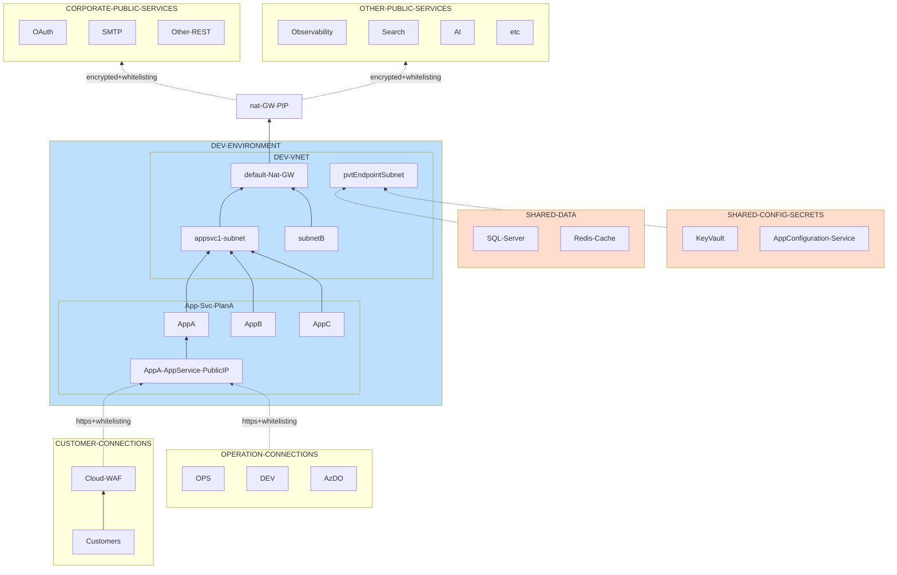

> Хочешь погонять? У нас есть Jupyter notebook, который отлично работает на [Binder](https://mybinder.org/v2/gh/eosfor/scripting-notes/HEAD).

В  процессе в Azure многие компании устремляются к сложным топологиям hub-and-spoke, чтобы разместить свои приложения, даже когда необходимости в такой сложности нет. Обычно их мотивируют словами: "Так требует [Microsoft Cloud Adoption Framework (CAF)](https://learn.microsoft.com/en-us/azure/cloud-adoption-framework/)". Но, взявшись за это дело, они сталкиваются с массой новых вопросов, о которых раньше даже не думали. Например, с неожиданной потребностью управлять IP-адресами или изучать VLSM subnetting – темы, которые для большинства Dev команд – темный лес. И когда сеть уже настроена, приключения только начинаются: вам предстоит разбираться с приватным DNS, доступом к внутренним ресурсам и многим другим.

Однако, если задуматься, многие сервисы Azure, включая Azure Web Apps, изначально были созданы для публичного использования. Некоторые даже не предполагали интеграцию с VNET, и такая модель была вполне приемлема.

В этом рассказе мы попробуем пойти более простым путем, чтобы безопасно разместить Web Apps, минуя все эти сетевые препятствия.
<!--more-->

Наша цель – простота, но не в ущерб безопасности. Эта простота касается как архитектуры инфраструктуры, так и шаблонов развертывания (Bicep templates), обеспечивая плавный процесс автоматизации. Мы рассмотрим возможности создания простой, но безопасной архитектуры, отбросив все лишнее и сосредоточившись на том, что действительно важно для безопасной работы Web Apps в Azure.

## Обзор

Предоставленная диаграмма наглядно демонстрирует архитектуру типичной конфигурации приложения, работающего в основном на Web Apps. Эти Web Apps 'размещены' в виртуальной сети (VNET), используя функцию интеграции Web App VNET (Web App VNET integration). К сожалению, у нас нет другого выбора, кроме как использовать VNET. Azure Web Apps не предлагают простого метода назначения им статического публичного IP. Таким образом, мы используем VNET и NAT Gateway, чтобы исходящий трафик имел известный публичный IP, что позволяет легко внести наши приложения в белый список корпоративных ресурсов или любого другого публичного сервиса. То, что упрощает этот процесс, – мы не планируем соединять его с какой-либо внешней сетью. Таким образом, мы всегда можем использовать диапазон 10.0.0.0/8, что почти полностью исключает необходимость управления IP-адресами.

Пока у нас есть "VNET-заглушка", мы также можем использовать Private endpoints для подключения к бэкенд-сервисам. Однако это необязательно, если вы можете добавить публичный IP NAT Gateway в список разрешенных IP прямо на самих этих сервисах. Это упростит все еще больше. Однако не все службы поддерживают межсетевой экран (Firewall) на уровне службы; например, Azure App Configuration, который я использую, не имеет такой функции. В этой архитектуре я нацелился на единый подход, поэтому я не хотел, чтобы некоторые бэкенд-сервисы использовали Private Link, а другие – белый список (Whitelist) в качестве меры безопасности. Это единственная причина, по которой я решил пойти сложным путем и подключить все бэкенд-сервисы с использованием частных конечных точек. В общем, если бы App Configuration поддерживал межсетевой экран на уровне службы, я бы обошелся без Private endpoints. Автоматизация стала бы намного проще.

С другой стороны, исходящий трафик из Web Apps следует стандартному пути от публичных конечных точек каждого Web App. Некоторые Web Apps могут иметь отключенный публичный доступ, в то время как другие могут быть доступны по мере необходимости. В целях безопасности мы разрешаем только определенным IP выполнять управляющие действия. Все это позволяет иметь "частную" версию Web Apps, так как мы можем внести их в белый список для каждого разработчика. Мы также можем использовать Cloud Web Application Firewall (WAF), например, Cloudflare WAF, чтобы пропустить трафик клиентов и разрешить только коммуникации, исходящие от WAF, в Web Apps.

С точки зрения безопасности мы можем утверждать, что на L3 мы можем гарантировать, что только известные диапазоны могут устанавливать TCP-соединения с нашими публичными приложения. Внутри этих "разрешенных туннелей" весь трафик зашифрован. Наконец, мы ОБЯЗАНЫ требовать межсервисной аутентификации между всеми коммуницирующими конечными точками. Взаимная аутентификация лучше, если это возможно.

Вот некоторые преимущества этого подхода:

1. **Простота и настроимость**: Избавление от лишней сложности, связанной с VNET, упрощает инфраструктуру и делает изменения легче.
2. **Environment без VM**: Нет необходимости во временных VM,  Jump Boxes или подобных ресурсах.
3. **Доступность**: Позволяет командам DEV получать удаленный доступ, сохраняя конфиденциальность через белый список (Whitelist), без необходимости настройки VPN или DNS/hosts-файлов.
4. **Стоимостная эффективность**: Использует только необходимые ресурсы, избегая дополнительных расходов на поддерживающие компоненты, такие как Azure Firewall.



Мы можем разделить нашу систему на несколько главных частей:

- **Environment**: Здесь все, что нужно для работы приложений, например, Web Apps.
- **Данные**: Здесь управляем базами данных и другими подобными вещами.
- **Конфигурация и Секреты**: Здесь храним настройки и секретную информацию.

Основная идея в том, чтобы каждый раздел был независимым. Разработчики управляют Environment(ами), но есть вещи, которыми другие люди могут управлять в целях безопасности. Нам нужно, чтобы эти разделы были отдельными, чтобы можно было контролировать доступ к ним.

Еще одна задача - сделать так, чтобы эти части легко работали вместе, но при этом были независимыми на этапе создания/развертывания. Чтобы это сделать, мы используем что-то, что назовем "Interconnect". Это как мост между разделами. Он помогает им общаться друг с другом, не мешая их работе. В некотором смысле напоминает [mediator pattern](https://en.wikipedia.org/wiki/Mediator_pattern), когда есть некий центральный элемент, который знает чуть больше чем остальные элементы и умеет их связать друг с другом.

Преимущества "Interconnect":

1. **Простота**: Он упрощает управление каждой частью.
2. **Гибкость**: Можно легко соединять разные части без лишней работы.
3. **Автоматизация**: Он может автоматически создавать нужные связи между частями.
4. **Безопасность**: Он помогает контролировать, как части общаются между собой, делая это безопасно.

Таким образом, у нас есть четыре основные части: Environment(ы), Данные, Конфигурация и Interconnect, который все это соединяет.

### Несколько слов о соглашениях по именованию

Конечно, давайте попробуем сделать это проще:

Не стоит усложнять себе жизнь придумыванием сложных правил для именования в Azure. Вот основные причины:

- **Сложность**: Иногда, пытаясь упростить вещи, мы делаем их сложнее. Например, создание правил для имен может потребовать дополнительной работы и программирования, что увеличивает риск ошибок.
- **Задержки**: Если что-то новое появляется в Azure или не соответствует нашим правилам именования, это может замедлить работу и инновации.
- **Лишняя работа**: Azure уже все знает о своих ресурсах. Не нужно дублировать эту информацию в имени ресурса, это как давать имя книге, которая уже имеет название. Если нужна дополнительная информация, лучше просто спросить у Azure.

В общем, вместо того чтобы придумывать сложные правила для именования, лучше просто дать ресурсам понятные имена и использовать PowerShell или любой другой способ программного взаимодействия с Azure, чтобы получить всю нужную информацию и использовать ее в вашей автоматизации.

### Подготовка инфраструктуры

Давайте оживим все это.

> Ниже представлен раздел для справки. Вы можете попробовать все это самостоятельно в [Binder](https://mybinder.org/v2/gh/eosfor/scripting-notes/HEAD).
> Весь исходный код находится в репозитории [здесь](https://github.com/eosfor/scripting-notes/tree/main/notebooks/en).

### Вход в Azure

Сначала импортируем модуль PS и входим в Azure. Мы используем `UseDeviceAuthentication`, так как Jupyter notebooks может работать где-то в контейнере, и у него нет пользовательского интерфейса или браузера. Также мы загружаем небольшую библиотеку вспомогательных функций для нашего эксперимента.

```powershell
Install-Module Az
Import-Module az
. ./helper3.ps1

Login-AzAccount -UseDeviceAuthentication

```

### Создание общих ресурсов

Теперь мы готовы создать все с нуля. Чтобы все это было повторяемо, сначала мы создаем общие элементы. Так в будущем, когда нам понадобятся только окружения приложений, мы всегда можем пропустить эти шаги.

Создаем ресурсные группы

```powershell
$sharedEnvironments = 'SHARED-DATA', 'SHARED-CONFIGURATION'
$location = 'westus'

$sharedEnvironments | % { 
    $resourceGroup = Get-AzResourceGroup -Name $_ -ErrorAction SilentlyContinue

    if (-not $resourceGroup) {
        # If it doesn't exist, create it
        New-AzResourceGroup -Name $_ -Location $location
    }
}
```

Теперь применяем шаблоны

```powershell
New-AzResourceGroupDeployment -Name 'shared-data-provisioning' -ResourceGroupName 'SHARED-DATA' -TemplateFile ./dataLayer.bicep
New-AzResourceGroupDeployment -Name 'shared-config-provisioning' -ResourceGroupName 'SHARED-CONFIGURATION' -TemplateFile ./configSecretsLayer.bicep
```

### Создание нового окружения (Environment)

Следующий этап включает настройку реального окружения. Мы стремимся избегать создания нескольких окружений одновременно, учитывая что в будущем мы можем захотеть обновить только одно из них.

```powershell
$environmentRg = 'DEV'
$location = 'westus'

$environmentRg | % { 
    $resourceGroup = Get-AzResourceGroup -Name $_ -ErrorAction SilentlyContinue

    if (-not $resourceGroup) {
        # If it doesn't exist, create it
        New-AzResourceGroup -Name $_ -Location $location
    }
}
$envProvisioningResults = New-AzResourceGroupDeployment -Name 'dev-env-provisioning' -ResourceGroupName $environmentRg -TemplateFile ./appLayer.bicep
```

### Взаимодействие между общими элементами и окружениями

Теперь пришло время для `interconnect`. На этом этапе нам нужно интегрировать общие ресурсы в новый Environment. Мы стремимся упростить этот процесс и сделать его динамическим.
Если в двух словах, то происходит следующее:
- Перечисляются все ресурсы в `source` окружении.
- Определяются и выбираются те ресурсы, которые поддерживают Private Link/Private Endpoints, и интегрирует их в `target` Environment.
- Создает необходимые частные DNS-зоны для сервисов найденных на предыдущем этапе.
- Сопоставляются Private Link/Private Endpoints с соответствующими частными DNS-зонами, обеспечивая автоматическую регистрацию в них.

```powershell
Connect-Environment -SourceEnvResourceGroup 'SHARED-DATA' -TargetEnvResourceGroup 'DEV'
Connect-Environment -SourceEnvResourceGroup 'SHARED-CONFIGURATION' -TargetEnvResourceGroup 'DEV'
```

### Развертывание Web Apps

> Содержание этого раздела не является реальным способом выполнения развертывания. Это процесс и набор скриптовых шагов, которые вы можете использовать в вашем процессе автоматической доставки для автоматизации развертывания приложений.
>

Обычно, когда вы создаете Web Apps, вам нужно знать App Service Plan, на котором будет работать ваше приложение, а также подсеть, используемую этим планом. К сожалению, между планом и подсетью нет прямой связи. Эта связь появляется, когда вы создаете первое приложение в плане и подключаете его к сети. Все последующие приложения должны использовать ту же подсеть.

Таким образом, перед созданием Web App вам нужно определить эти два параметра. Команда ниже, из библиотеки которую мы загрузили ранее, помогает в этом.

```powershell
$webAppMappingHtml = Get-AppServicePlanDetail -ResourceGroupName 'DEV'
```

После того как вы выбрали план для размещения вашего приложения, вы можете создать новые Web Apps, как указано ниже. Если в плане нет Web Apps, вы должны указать имя виртуальной сети (vnet) и имя подсети. Если в плане уже есть хотя бы одно приложение, эти значения будут определены автоматически. Функции тоже из библиотечки.

```powershell
# no web apps yet
New-WebApp -ResourceGroupName 'DEV' -TargetAppSvcPlan 'dev1-appsvc-plan' -TargetSubnetName 'appsvc1-subnet' -TargetVnetName 'application-stub-vnet' -WebAppName  'testWebApp1-nbrylply'

# there is one now
New-WebApp -ResourceGroupName 'DEV' -TargetAppSvcPlan 'dev1-appsvc-plan' -WebAppName  'testWebApp2-nbrylply'
```

### Очистка

Почистим все за собой :).

```powershell
Remove-AzWebApp -ResourceGroupName 'DEV' -Name 'testWebApp1-nbrylply' -Force
Remove-AzWebApp -ResourceGroupName 'DEV' -Name 'testWebApp2-nbrylply' -Force
```

```powershell
Remove-AzResourceGroup -ResourceGroupName 'DEV' -Force
Remove-AzResourceGroup -ResourceGroupName 'SHARED-DATA' -Force
Remove-AzResourceGroup -ResourceGroupName 'SHARED-CONFIGURATION' -Force
```