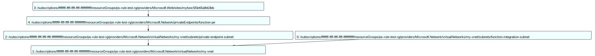

Когда мы проверяем инфраструктуру в Azure, не всегда достаточно просто посмотреть на каждый ресурс отдельно. Например, важно убедиться, что у каждой Azure-функции есть ровно одна private endpoint, или что все ресурсы правильно объединены в общую сеть. В таких случаях нужно видеть полную картину целиком.

Именно здесь пригодятся два инструмента: PSRule и модуль PSQuickGraph. Как их подружить и зачем это нужно — расскажу в этой заметке.

<!-- MORE -->

## Введение в PSRule и PSRule.Rules.Azure

При разработке и сопровождении инфраструктуры как кода (Infrastructure as Code, IaC) важно не только создавать, но и проверять шаблоны на соответствие лучшим практикам и стандартам. [PSRule](https://github.com/microsoft/PSRule) — это кросс-платформенный модуль PowerShell, который проверяет IaC и другие объекты с помощью настраиваемых правил. Он легко интегрируется с популярными системами непрерывной интеграции (CI), помогая автоматизировать проверки.

[PSRule.Rules.Azure](https://github.com/Azure/PSRule.Rules.Azure) расширяет возможности PSRule, добавляя большой набор правил для проверки Azure-ресурсов и шаблонов IaC. В нем более 400 готовых правил, основанных на принципах Azure Well-Architected Framework, что позволяет разработчикам и инженерам легко проверять соответствие инфраструктуры рекомендациям Microsoft.

Одна из очень полезных возможностей PSRule — работа с Azure Bicep. PSRule «разворачивает» шаблоны Bicep и применяет правила к объектам, которые будут создаваться. Таким образом можно проверить, соответствует ли ваша инфраструктура требованиям ещё до её развертывания в Azure. Фактически это статический анализатор для кода Bicep.

Однако до недавнего времени типичным сценарием работы PSRule была проверка каждого отдельного объекта на соответствие вашим правилам или правилам Microsoft. А у меня возник немного другой сценарий.

## Наш сценарий

В нашем сценарии есть несколько ролей. Сначала работает `Архитектор`. Он отвечает за проектирование инфраструктуры, учитывая бизнес-требования, требования безопасности и технические ограничения компании. Архитектор описывает дизайн в виде подробного документа, создаёт диаграммы и примеры.

После того, как архитектура готова, к работе подключается `Инженер`. Его задача — реализовать дизайн, используя инструменты вроде `Bicep` и `PowerShell`.

Но иногда даже подробной документации и диаграмм недостаточно для точного понимания задумки Архитектора. Чем сложнее инфраструктура, тем больше риск ошибки. Поэтому, когда инженер завершает реализацию, архитектору важно убедиться, что всё сделано правильно. Тут как раз и помогает PSRule, который позволяет быстро написать набор правил для проверки инфраструктуры на основе Bicep-кода и убедиться, что ошибок или неточностей нет.

## Немного деталей

Процесс работы PSRule выглядит как конвейер: объекты из Bicep-шаблонов сначала преобразуются в родной для Azure ARM-формат и затем по одному проходят через проверки. Проблема в том, что конвейер видит только один объект за раз. Сложные зависимости вроде private endpoints могут выпадать из контекста.

Идея, как решить эту проблему, простая: пока ресурсы проходят через PSRule, мы постепенно складываем их в граф зависимостей с помощью `PSQuickGraph`. Зная, как именно связаны ресурсы, мы можем добавлять их в виде вершин и рёбер графа. Когда все ресурсы обработаны, мы можем посмотреть на граф и убедиться, что все связи корректны.

Правда, реализовать это в блоках `Rule` не совсем правильно, так как дополнительная логика, которую мы выполняем, по сути, не является правилом. Поэтому в PSRule есть специальный механизм — [Conventions](https://microsoft.github.io/PSRule/v2/concepts/PSRule/en-US/about_PSRule_Conventions/). Это расширение позволяет добавлять пользовательскую логику в конвейер до его начала, после каждого объекта и в самом конце.

Мы создаём `Convention` с двумя блоками: блок `-Process` запускается для каждого объекта, а блок `-End` выполняется в самом конце.

В блоке `-Process` мы проверяем тип ресурса и, исходя из этого, добавляем нужные вершины и связи в граф. Например, для виртуальной сети (VNET):

```powershell
if ($TargetObject.type -eq 'Microsoft.Network/virtualNetworks') {
    $global:vnetId = $TargetObject.id

    foreach ($subnetResource in $TargetObject.resources) {
        Add-Edge -From $subnetResource.id -To $TargetObject.id -Graph $global:connectionGraph
    }
}
```

Для веб-приложений (Web Sites) проверяем интеграцию с VNET:

```powershell
if ($TargetObject.type -eq 'Microsoft.Web/sites') {
    $vnetIntegrationObject = $TargetObject.resources |
        Where-Object { $_.Type -eq 'Microsoft.Web/sites/networkConfig' }

    $global:webSites += $TargetObject.id

    Add-Vertex -Graph $global:connectionGraph -Vertex $TargetObject.id
    Add-Edge -From $TargetObject.id -To $vnetIntegrationObject.properties.subnetResourceId -Graph $global:connectionGraph
}
```

Когда все объекты уже в графе, можно выполнить проверку зависимостей:

```powershell
# проверяем путь от каждого веб-приложения до VNET
foreach($webApp in $global:webSites){
    $p = Get-GraphPath -From $webApp -To $global:vnetId -Graph $global:connectionGraph
    if ($null -eq $p) {
        Throw "Нет пути от приложения до VNET"
    }
}
```

Тут есть сложность: в конце конвейера уже нельзя использовать стандартные методы PSRule (типа `$Assert`), чтобы чётко сказать, прошла проверка или нет. Пока что приходится бросать исключения, но я ищу более красивый вариант решения.

Также графы, которые мы строим через `PSQuickGraph`, можно экспортировать в картинку для визуализации:

```powershell
Export-Graph -Graph $global:connectionGraph -Format MSAGL_SUGIYAMA -Path ./output/graph.svg
```

Это удобно для быстрого визуального анализа и поиска проблем.



Получается удобно: отдельно собираем данные, отдельно строим граф, отдельно проверяем его. Так мы точно уверены, что наша инфраструктура в Azure реализована именно так, как задумывалось.

Ну и как вишенка на торте, увидеть и даже попробовать можно прямо тут:

[](https://github.com/codespaces/new?repo=eosfor/psrule-demo&ref=main)

А вы сталкивались с подобными задачами? Поделитесь, как вы проверяете зависимости между ресурсами в Azure!
